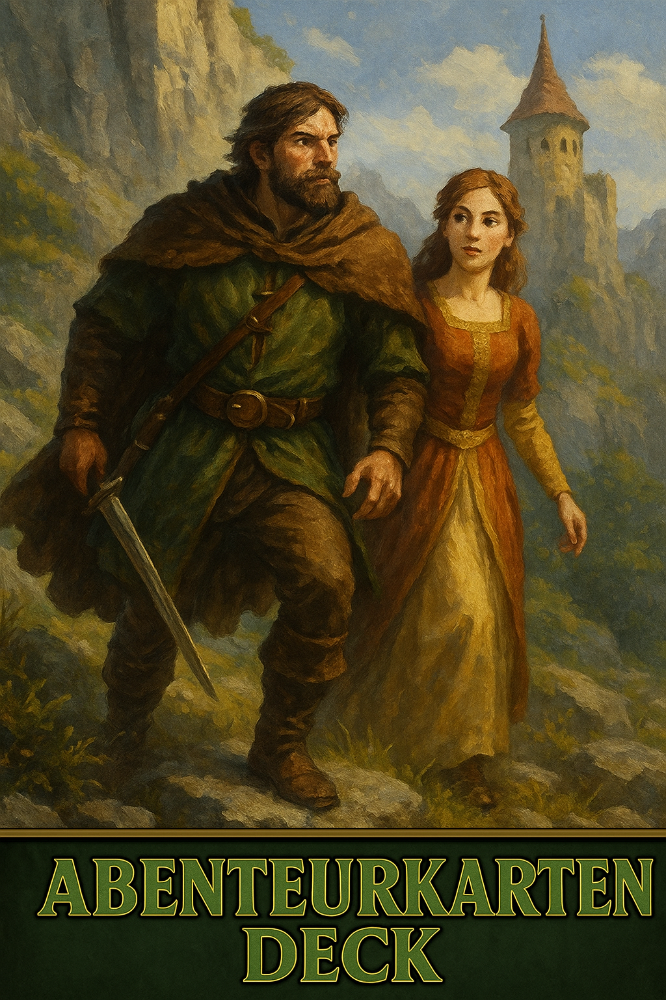

# OnkelDoms's Abenteuerkarten Deck



**Ein FoundryVTT-Modul zur Nutzung von Abenteuerkarten im Stil von Savage Worlds, vollständig für DSA5 umgesetzt, jedoch für jedes beliebige System anpassbar**  
Die Karten verleihen Spielern narrative Macht und ermöglichen unerwartete Wendungen und kreative Spielimpulse.

---

## 🧩 Features

- Automatisches Abenteuerkartendeck beim ersten Start
- Automatische Erstellung von Kartenhänden pro Spielercharakter (nur bei GM-Start)
- Kartenhand mit schönem Layout im Stil des Originaldecks
- Karten können:
  - im Chat ausgespielt werden
  - an andere Spieler weitergegeben werden
  - per Rechtsklick als großes Bild angezeigt werden
- Nur Spielleiter kann Karten austeilen
- Ablagestapel sichtbar, aber nicht nutzbar durch Spieler

---

## 📦 Installation

### 🧭 Manifest URL

```text
https://raw.githubusercontent.com/OnkelDom/onkeldom-abenteuerkarten-deck/main/module.json
```

1. Öffne in FoundryVTT den **Modul-Manager**
2. Klicke auf **Modul aus Manifest installieren**
3. Füge die Manifest-URL ein und bestätige

---

## 💡 Verwendung

### Als Spielleiter:
- Stelle sicher, dass das Deck automatisch erstellt wurde (`Abenteuerkarten`)
- Verwende das Kontextmenü oder Buttons zum Weitergeben oder Ausspielen der Karten
- Karten werden nach dem Ausspielen automatisch in den Ablagestapel gelegt

### Als Spieler:
- Deine Kartenhand wird automatisch erstellt
- Öffne deine Kartenhand über das Charaktermenü oder GM-Ansicht
- Klicke auf Karten, um Details zu sehen oder sie zu verwenden

---

## 🎨 Eigene Karten erstellen

- Im Ordner `assets/cards` befinden sich **alle Kartenvorlagen**, inkl. Rückseite.
- Du kannst das Template `Abenteuerkarten_Template.xcf` im Ordner `assets` verwenden, um eigene Karten zu erstellen.
- Nutze dazu Grafikprogramme wie **GIMP**, **Photoshop** oder **Photopea**.
- Neue Karten müssen anschließend in der Datei `abenteuerkarten.json` eingetragen werden:
  - `name` – Name der Karte
  - `img` – Pfad zum Kartenvorderbild
  - `back.img` – Pfad zur Rückseite
  - Optional: `text` und `description` für Effekte oder Chatanzeige

⚠️ **Hinweis:** Beim Hinzufügen eigener Karten musst du sicherstellen, dass die JSON-Struktur korrekt bleibt und die Dateiendungen alle korrekt sind!


---

## ⚙️ Abhängigkeiten

- **FoundryVTT** ab Version `12.x`

---

## 📁 Modulstruktur

```
onkeldom-abenteuerkarten-deck/
├── module.json
├── index.js
├── style.css
├── abenteuerkarten.json
├── templates/
│   ├── adventurehandsheet.hbs
│   ├── adventurecard-chatcard.hbs
│   └── chooserecipientdialog.hbs
└── assets/
    ├── logo.png
    ├── cover.png
    └── cards/

```

---

## 🧑‍💻 Autor

**Onkel Dom**  
📧 kontakt: Discord  @OnkelDom
🌐 Webseite( https://datengnom.de/ )

---

## 📜 Lizenz

Dieses Modul steht unter der MIT-Lizenz – frei zur Nutzung, Veränderung und Verbreitung. Bilder und Namen basieren auf Eigenkreationen und dürfen mit Verweis verwendet werden.
